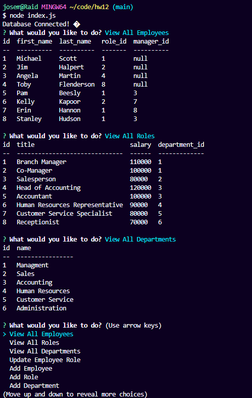

# Employee System Tracker 📝

## Description 📃

This repo/code gives a user the ability to View, Add, Update, and Remove an employee from the system database. When updating an employee, User is provided the option to change the manager, identified by the "ID" role. Inquirer is required to run the code as will as node modules.

## Preview

* To view how to run the code below is a YouTube Video walktrough.
[Employee System Tracker](https://youtu.be/GKx_pR-pnwY)

* Below is an image preview 

## Links 🖊️

* Here is the link to my github 🐈‍⬛: [Github/JMGuzman-784](https://github.com/JMGuzman-784/employee-tracker)

* Here is the code 📜: [JMGuzman-784/Employee-Tracker](https://github.com/JMGuzman-784/employee-tracker/blob/main/index.js)